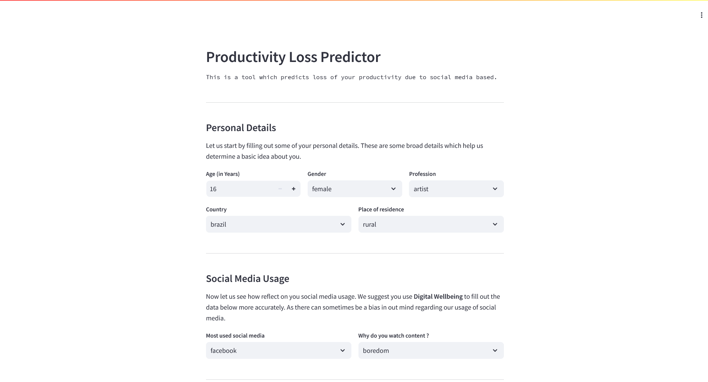
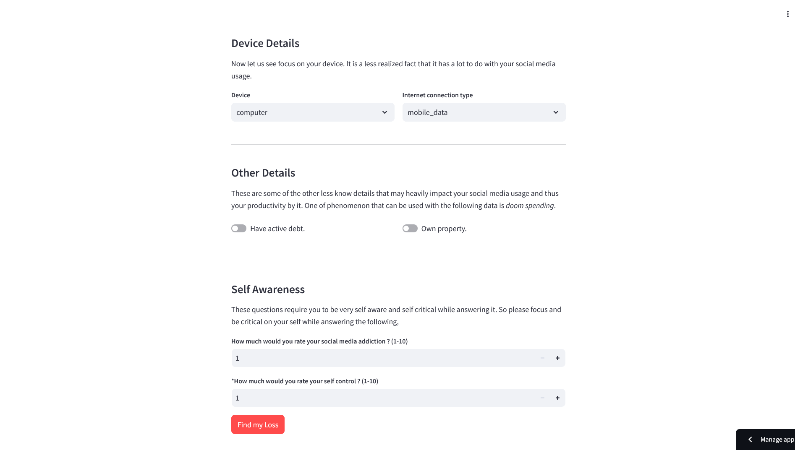

Here's the updated README with an added "Screenshots" section to showcase the UI:

---

# 📉 Productivity Loss Predictor Due to Social Media Use

Predict productivity loss by analyzing social media usage patterns! This project explores how social media usage impacts productivity and provides a predictive model to assess productivity loss. It combines data exploration, preprocessing, model training, and an interactive web app interface for a smooth user experience.


---

🔗 **Live Demo**: [Productivity Loss Predictor](https://social-media-impact.streamlit.app/)  
🔗 **GitHub Repo**: [Productivity Loss Predictor](https://github.com/ketanip/productivity-loss-predictor)  
📊 **Data Source**: [Time Wasted on Social Media - Kaggle](https://www.kaggle.com/datasets/beltagymohamedsaleh/time-waste-on-social-media)  

---

## 🖼️ Screenshots

### User Interface



---

## 🌟 Key Features
- **Predict Productivity Loss**: Model the impact of social media use on productivity using machine learning.
- **Extensive Data Processing**: Clean, preprocess, and transform data for accurate prediction.
- **Multiple Algorithms Tested**: Tested both regression and classification algorithms to find the best model for predicting productivity loss.
- **Voting Ensemble for Accuracy**: Top 3 models are combined using a hard voting ensemble to maximize prediction accuracy.
- **Streamlit Web Application**: Provides an intuitive UI for end-users to make predictions and visualize results.
- **Dockerized Deployment**: Easily deployable Docker setup for streamlined application hosting.

---

## 🏗️ Project Workflow

1. **Requirements Installation**: Install necessary packages from `dev.requirements.txt` and `prod.requirements.txt`.
2. **Data Exploration**: Analyze dataset features and distributions.
3. **Data Cleaning**: Handle missing data, remove duplicates, and filter outliers.
4. **Data Preprocessing**: Normalize numerical data, encode categorical data, and perform feature scaling.
5. **Model Preparation**: Train and evaluate multiple models to identify the top performers.
6. **Model Selection and Pipeline Creation**: Assemble the top models into a voting classifier.
7. **Pipeline Testing**: Ensure accuracy and reliability of the entire model pipeline.
8. **Model Exporting**: Save the final model and unique values using `pickle` for easy deployment.

---

## 📊 Algorithms Used and Selection Process

To create a robust prediction model, several machine learning algorithms were tested, both in regression and classification modes. The final model is a voting classifier, which leverages the strengths of the top 3 models identified during testing.

### Algorithms Tested
**Regression Algorithms**:
- **Linear Regression**
- **Lasso CV** (L1 regularization to reduce overfitting)
- **Ridge CV** (L2 regularization)
- **Support Vector Machine Regression**

**Classification Algorithms**:
- **Decision Tree Classifier**
- **Random Forest Classifier**
- **Support Vector Machine Classifier**
- **K-Neighbors Classifier**
- **Gradient Boosting Classifier**

#### Ensemble Selection
Based on accuracy metrics (especially the r2 score), the top 3 models chosen for the ensemble were:
- **Decision Tree Classifier**
- **Gradient Boosting Classifier**
- **Random Forest Classifier**

These models were combined using a **hard voting classifier**, enabling the final model to leverage their combined strengths.

---

## 📂 Project Directory Structure

```plaintext
data/
  ├── time-wasted-on-social-media.csv       # Dataset used for training

output/
  ├── model_pipeline.pkl                    # Exported model pipeline including preprocessor and model
  ├── model_unique_values.pkl               # Saved unique values for consistent data processing

webapp/
  ├── __init__.py
  ├── app.py                                # Streamlit app for UI and user interaction

.dockerignore
.gitignore
Dockerfile
docker-compose.yml
requirements/
  ├── dev.requirements.txt                  # Development dependencies
requirements.txt                            # Optimized production dependencies

training.ipynb                              # Jupyter Notebook with training pipeline and model exploration
```

### 🐳 Docker Setup
- **Dockerfile**: Configured for streamlined deployment of the Streamlit app with all dependencies.
- **Exposes Port**: `8501` (Access the app on `localhost:8501`)


---

## 🚀 Getting Started

### Prerequisites
- Python 3.8+
- Docker
- Streamlit

### Installation

1. **Clone the repository**:
   ```bash
   git clone https://github.com/ketanip/productivity-loss-predictor.git
   cd productivity-loss-predictor
   ```

2. **Install dependencies**:
   For development:
   ```bash
   pip install -r requirements/dev.requirements.txt
   ```
   For production:
   ```bash
   pip install -r requirements/prod.requirements.txt
   ```

3. **Run the app locally**:
   ```bash
   streamlit run webapp/app.py
   ```

4. **Docker Deployment**:
   Build and run the Docker container:
   ```bash
   docker build -t productivity-loss-predictor .
   docker run -p 8501:8501 productivity-loss-predictor
   ```

### Using Docker Compose
```bash
docker compose up --build
```

---

## 👥 Contributing
Contributions are welcome! To contribute:

1. Fork the repository.
2. Create a feature branch (`git checkout -b feature-branch`).
3. Commit your changes (`git commit -m 'Add new feature'`).
4. Push to the branch (`git push origin feature-branch`).
5. Open a pull request.

---

## 📜 License
This project is licensed under the MIT License.

---

## 📬 Contact

For questions or issues, please open an issue in the repository or contact the project maintainer through GitHub.